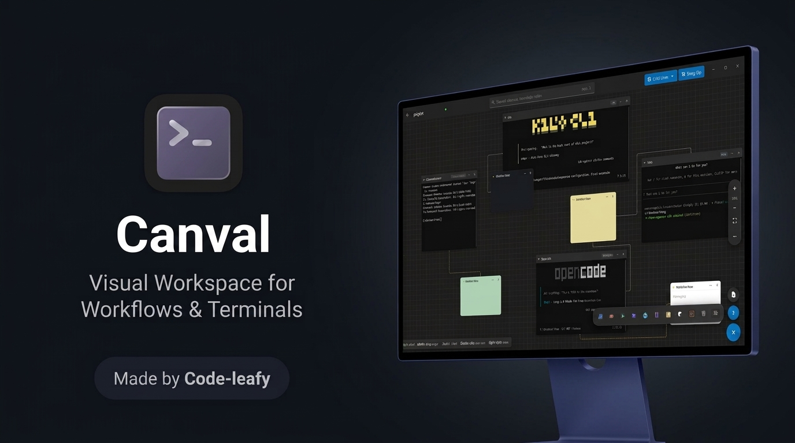
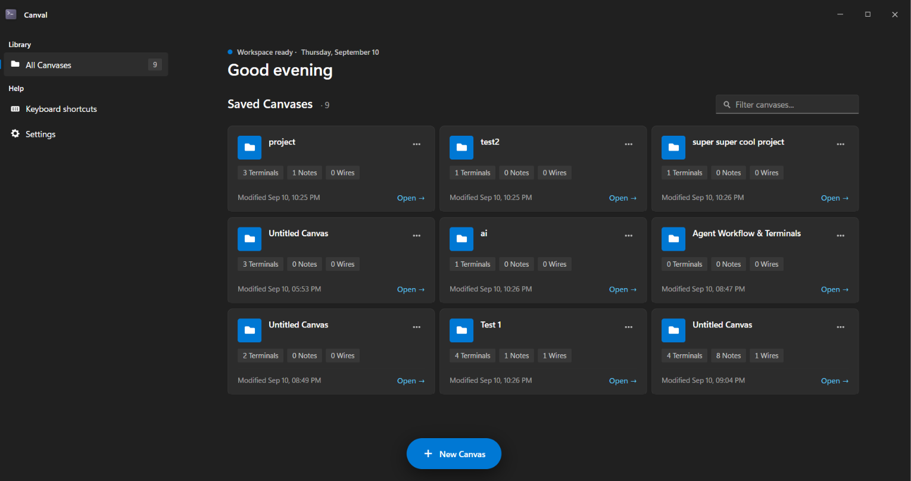
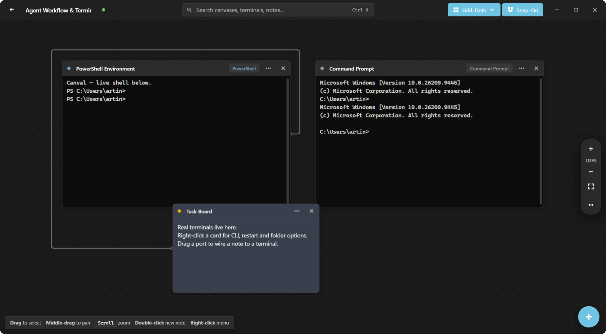
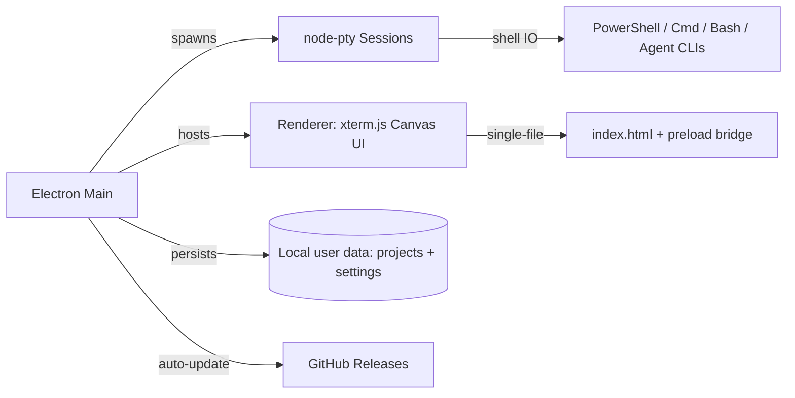

<div align="center">



# Canval

A sleek **desktop canvas** for running real PTY-backed CLI terminals side-by-side with notes and agent workflows — on a calm, infinite canvas for Windows.

[](LICENSE)
[](https://github.com/Code-Leafy/Canval/stargazers)
[](https://github.com/Code-Leafy/Canval/releases)
[](https://github.com/Code-Leafy/Canval/releases)
[](https://electronjs.org)

</div>

---

## Screenshots

<div align="center">




</div>

---

## Overview

Canval is one Electron application: a WinUI-style desktop shell around real pseudoterminals. Each card on the canvas is a live shell (PowerShell, Cmd, Bash, Claude Code, Codex, OpenCode, Gemini, Kilo, Cline, FreeBuff, or any custom CLI) with GPU-accelerated rendering, plus rich notes and visual wires that map how your agents and shells connect.

Everything is stored locally and offline-first. Canvases restore exactly — terminals respawn in their working folders, notes keep their scrollback snapshots, and wires reconnect.

---

<details open>
<summary><kbd>Platform & Distribution</kbd></summary>

Canval ships as a Windows installer (`Canval-Setup-<version>.exe`, NSIS) built with `electron-builder`. Releases are published on GitHub, and the installed app checks for updates automatically (plus a manual **Check for updates** in the sidebar).

</details>

---

## Core Features

### Real PTY Terminals

Every terminal card is a genuine `node-pty` session — not a simulation. Full TUI mouse support (click + drag + scroll), 256-color and truecolor output, Unicode, alternate-screen apps, and working-directory-aware spawning.

### Infinite Canvas Workspace

Pan (middle-drag), zoom (scroll / rail / fit), snap-to-grid with dots/lines/crosses backgrounds, rubber-band multi-select, Ctrl+click groups, and group drag/delete — like a native desktop.

### Notes & Wires

Obsidian-style notes with color palettes sit next to terminals. Drag between ports to wire cards together with obstacle-aware orthogonal routing, custom colors, and solid/dashed/dotted styles.

### CLI Presets & Detection

One-click presets for popular CLIs with automatic PATH + well-known-location detection, install guidance, copyable install commands, and manual executable locate with per-CLI saved overrides.

### Native Feel

Frameless rounded window with taskbar icon, custom caption controls, system accent matching (Auto follows Windows), light/dark themes, custom accent colors, and per-card GPU (WebGL) or compatibility (DOM) rendering.

### Local-First Projects

Each canvas keeps its working folder, camera, cards, and wires in `%APPDATA%`-adjacent user data. Auto-save with busy indicator, rename/duplicate/delete, and scrollback snapshots.

<div align="center">

| Agent Ready |
| :--- |
| Point any canvas folder at a repo, spawn your coding agent CLI inside a card, and wire its notes alongside — Canval keeps the whole workflow visible in one place. |

</div>

---

## Quick Start

### 1. Install (Windows)

*No build required.*

1. Open [Code-Leafy/Canval/releases](https://github.com/Code-Leafy/Canval/releases) and download the latest `Canval-Setup-<version>.exe`.
2. Run the installer (per-user, no admin needed) and launch **Canval** from the Start Menu or desktop shortcut.
3. Click **New Canvas**, pick a working folder, and your first PowerShell terminal spawns automatically.

> Canval updates itself from GitHub releases. You can also check manually from the sidebar footer at any time.

### 2. Run from Source

Requires Node.js 20+ and Windows build tools (for `node-pty`).

```bash
# Clone and install
git clone https://github.com/Code-Leafy/Canval.git
cd Canvas
npm install

# Rebuild the native PTY module for Electron, then start
npm run rebuild
npm start
```

To produce the installer locally:

```bash
npm run dist
# -> dist/Canval-Setup-<version>.exe
```

---

## Usage

Inside Canval you can:

- Create canvases bound to a working folder from the floating **New Canvas** pill.
- Spawn terminals from the `+` speed-dial (or `Ctrl+T`), restart sessions, and change CLI presets per card.
- Double-click empty canvas for a note; drag ports to wire cards together.
- Rubber-band select, `Ctrl+Click` groups, `Del` bulk delete, middle-drag pan, `Ctrl+K` search.
- Switch GPU/compatibility rendering, fonts, cursor, scrollback, and WinPTY/ConPTY backends from **Settings**.

> Terminals need their CLIs installed separately (e.g. `npm i -g @anthropic-ai/claude-code`). Missing CLIs show install help with a copyable command instead of a raw error.

---

## Architecture



<details>

<summary><kbd>Project Structure</kbd></summary>

```text
Canvas/
├── index.html       # Entire UI: home, canvas, settings, dialogs (single file)
├── main.js          # Electron main: window, PTY pool, projects, updates
├── preload.js       # Secure window.tc bridge (context-isolated IPC)
├── icon.png/.ico/.svg # Official Canval artwork (window, taskbar, installer)
├── assets/          # README preview screenshots
├── package.json     # Deps, electron-builder config, GitHub publish target
├── README.md        # Setup, usage, and FAQ
├── LICENSE          # MIT license
├── .gitattributes   # LF line endings and binary asset handling
└── .gitignore       # node_modules, dist, logs
```

</details>

---

## Security Notes

- **Local-only**: no servers, no telemetry, no accounts. All IPC stays inside the app via a context-isolated preload bridge (`nodeIntegration: false`).
- **Shell access**: terminal cards run real shells with your user privileges — only spawn commands you trust, same as any terminal emulator.
- **Paste safety**: pasting into terminals goes through an explicit card-menu/clipboard action, never silently.
- **Updates**: auto-updates download only from this repository's GitHub releases over HTTPS (`electron-updater` + `latest.yml`).

---

## Operational Notes

### PTY backends

- **WinPTY** is the default: ConPTY input silently dies in some GUI-hosted environments, while WinPTY works everywhere on Windows.
- **ConPTY** is available per-settings for newer consoles. Sessions respawn automatically when you switch.

### Renderer modes

- **Auto (recommended)**: GPU WebGL when available, compatibility fallback otherwise (first 8 terminals take GPU).
- **Compatibility (software)**: CPU rendering for remote desktop and VMs.

### Endpoints (local IPC, not network)

- `pty:spawn/write/resize/kill` — terminal session lifecycle.
- `pty:which` — absolute-path CLI resolution (settings overrides → PATH → well-known dirs).
- `projects:list/create/load/save/rename/delete` — canvas persistence.
- `app:version`, `updater:check/quitInstall` — version + update flow.

---

<details>

<summary><kbd>FAQ</kbd></summary>

### Is this a web app or a terminal UI?

Neither — it is a **desktop app**. The UI is a native-feeling window; the terminals inside are real shells.

### Where are my canvases stored?

In the app's user-data directory on your machine (`%APPDATA%\Canval` area: `library.json` + per-canvas `project.json`). Nothing leaves your PC.

### Why does a terminal say a CLI is missing?

That CLI is not installed or not on PATH for GUI apps. The card shows install guidance with a copyable command, or point Canval at the executable manually — the override is remembered per CLI.

### Do TUI apps (lazygit, htop, …) get mouse support?

Yes — clicks, drags, and scrolling are forwarded for apps that enable mouse reporting. Native Console-API mouse apps depend on the PTY backend.

### How do updates work?

Each launch (and every 6 hours) Canval checks this repo's releases. When an update is downloaded, the sidebar offers a one-click restart to install.

### Is this project production-ready by default?

It is a local-first desktop tool: review the installer source, keep your CLIs updated, and only run commands you trust — same rules as any terminal.

</details>

<br>

<div align="center">

> **Educational Purpose Only:** This project is provided for educational and research purposes. Users are solely responsible for compliance with all local laws. The developer assumes no liability for misuse.

[MIT License](https://github.com/Code-Leafy/Canval/blob/main/LICENSE) · Crafted by [Code-Leafy](https://github.com/Code-Leafy)

</div>
